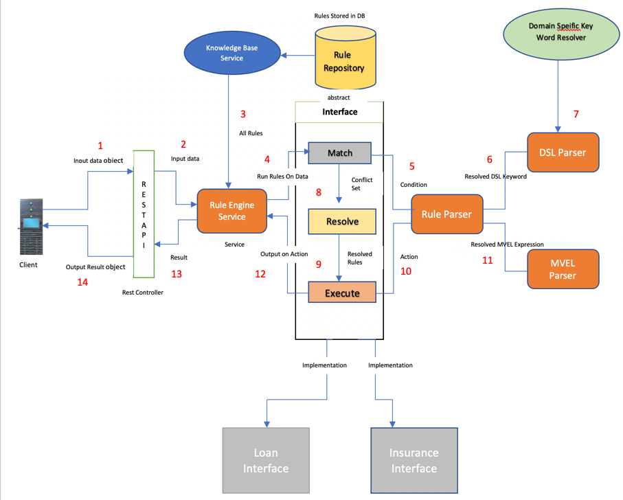
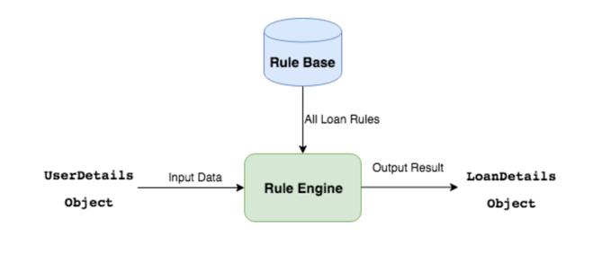
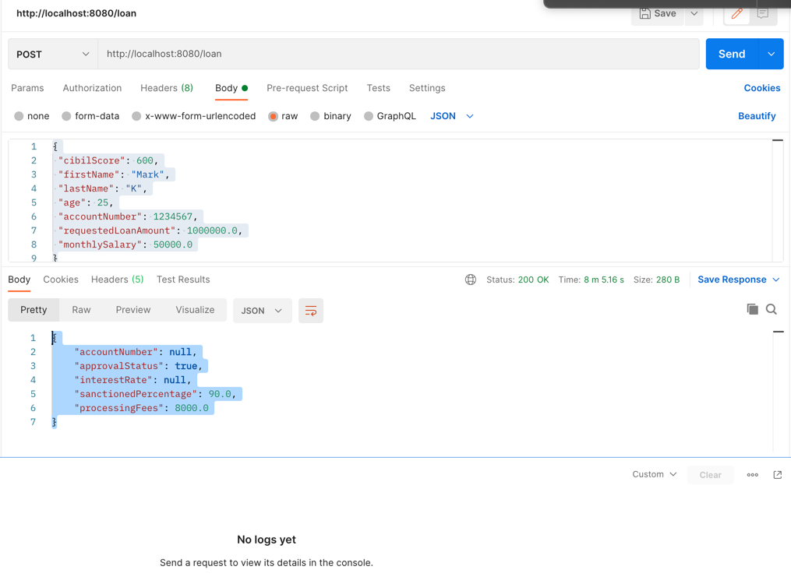

# Final Project

## Overview of the Project
Native Rule Engine is a simple java based rule engine libraries that supports creating rule with conditions and actions.
This will be further enhanced to be integrated with a workflow management system

## Interaction Diagram

We follow the above implementation framework and implement Rule-Engine step by step.
Here we implement rule-engine as a Rest API with SpringBoot and Maven framework.
For writing the rules, we use expression language (MVEL) and some domain-specific keywords.

All rules to be stored in DB (Postgress)

An abstract interface engine is implemented,which is use to implement differrent domain specific interface engine

A Key word resolve is implemented to resolve all domain specific key word.

Two parser has been designed one to parse mvel expression and other for DSL

Testing can be done through Junit or Postman .

## Technology Stack

SpringBoot : To create a rules-engine project as a rest API.

Gradle: Project build Framework.

MVEL 2.4: Expression language to write rules.

Java 8: Programing language.

PostgreSQL 9.4 Database: To store the rules.

Spring JPA: For DB Connection

## Rule Language Definition
The rule is a set of the condition followed by the set of actions. The rules are mainly represented in the if-then form.
In this implementation, for writing the rules, we use the MVEL expression language + Domain Specific Language.
Rule’s Language = MVEL + DSL

Here in this rule engine, we use the following format for DSL which is different from MVEL.

$(resolver-keyword.sub-keyword)
Resolver keyword could be considered as a keyspace of all sub keyword. For example, the bank is a resolver keyword and all bank related keyword like interest_rate, targe_done etc, etc are sub-keywords which return some values after some calculation. 
This formate is used to combine all the same related keywords together.
Except this other syntax will be the same as the MVEL expression. To make it more clear let’s take an example of the Loan-Rule-Engine.

## Sample Rule Definition
Domain: Loan
Rule 1: A person is eligible for home loan?

if:
1. He has monthly salary more than 50K.
2. And his credit score is more than 800.
3. And requested loan amount is less than 40L.
4. And bank's current year target not done for home loan. 
   
then:
1. Approve the home loan.
2. Sanction 80% of requested loan amount.

### Sample Rule in MVEL + DSL Format:
Condition:

input.monthlySalary >= 50000

&& input.creditScore >= 800

&& input.requestedLoanAmount < 4000000

&& $(bank.target_done) == false

Action:

output.setApprovalStatus(true);
output.setSanctionedPercentage(90);
output.setProcessingFees(8000);

input and output here can be treated as input object and output object respectfully

## Rules Repository

All rules are stored in a database (Postgress).All relevent queries are in the queries.sql file

### Rule Model Class

Basically, rules are in if-then form. It contains basically two parts, condition and action. But we have to define some more information to implement it. 

Namespace: Use to identify or club the same types of rules of a domain into one.

Id: Each rule could be identified with some unique Id.

Condition or pattern: Rule’s condition in the MVEL + DSL form.

Action: Rule’s action in the MVEL + DSL form.

Priority: It will use to decide which rule should execute first on input data.

Description: Show the description of the rule.

## DB Connection Service
Here for the DB connection, we use the Spring Data JPA. 
All Details are available in application.properties file

#### DB Model
Get the data from DB into RuleDbModel form.

#### Rule Repository
Define database queries or function in RulesRepository class.

#### KnowledgeBase Service
Define methods to access rules as per our requirements.

## DSL Parser
To resolve the DSL related keyword, we need to implement a keyword resolver.

### DSLResolver interface
This interface will be implemented by each domain-specific keywords. For example, BankResolver for getting the current interest rate and info of target done or not.

### DSL Keyword Resolver
The DSLKeywordResolver resolve all implemented keywords. 
Here getResolver(String keyword) method resolves the resolver-keyword and returns the object reference of that keyword resolver (Example: BankResolver).

## MVEL Parser
MVELParser to resolve this MVEL expression.

## Rule Parser
RuleParser is a wrapper of MVELParser and DSLParser. 
It is used to parse the rule’s condition and action. Condition execute on input data and action execution returns the output result.
Rule parser parses the rule expression in two steps:

Step 1 Resolve domain-specific keywords first: $(resolver-keyword.sub-keyword)

Step 2 Resolve MVEL expression.

Your application must have tests that demonstrate that the application works as expected. When you scope the application, you should take into account the tests that you need to write. A carefully designed and tested smaller application is better than an untested or poorly thought out complex application. Build something simple and beautiful that is well-tested. 

***Your tests should run automatically on every commit using GitHub actions.***

## Interface Engine

The inference engine is the core part of the rule-engine.
It executes the rule on input data mainly in three steps.

MATCH: Match the facts/conditions and data against the set of rules. It returns the set of satisfied rules.

RESOLVE: Resolve the conflict set of rules and give the selected one rule.

EXECUTE: Run the action of the selected one rule on given data and return the resulting output.

## RuleEngine REST API
A rest API or controller to pass the input as JSON and get the response from rule-engine

## Rules in DB

Rules are stored  in Postgres DB. You can use any other DB as per your feasibility.
If you don’t have Postgres then download and install it in your system or server. If you already have Postgres then, create the database rulebase and inside it create a table called rules .
Look at the query.sql file for the scripts

## Testing Application 

Testing can be done by using Postman or using Curl command's.Unit testcases also been provided under test directory
to test the rule engine

### service URL

http://localhost:8080/loan
method :Post

### Sample Request 
{
"cibilScore": 600,
"firstName": "Mark",
"lastName": "K",
"age": 25,
"accountNumber": 1234567,
"requestedLoanAmount": 1000000.0,
"monthlySalary": 50000.0
}

### Sample Resposne

{
"accountNumber": null,
"approvalStatus": true,
"interestRate": null,
"sanctionedPercentage": 90.0,
"processingFees": 8000.0
}

